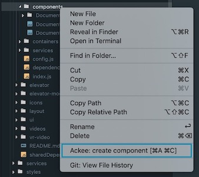

# Ackee Frontend VS Code extension

A set of usefull snippets and commands we use at Ackee for web apps development.

## Features

* Commands for project scaffolding (typescript supported)
* React/Fela snippets

## Contents

 - [Commands](#commands)
 - [Settings](#settings)
 - [Snippets](#snippets)

## Commands

### Create component
*  `Component.(j|t)sx` - React stateless component
* `index.(j|t)s` - index file to export the React component

### Create Fela component

Creates a folder with following structure:
*  `Component.(j|t)sx` - React stateless component with `styles` prop
*  `Component.styles.(j|t)s` - fela rules
* `index.(j|t)s` - index file to export the React component and wrap it with `connectFela`

#### Usage
1. Right click to a folder where you want to create a component
2. Select *"Ackee: create component"*
3. Type a name and press enter

> **Note**: The command can also be triggered by a shortcut `cmd+a cmd+c` or by VS Code command line. But in that case the component is created in root directory of a project, because VS Code API does not provide selected folder in the explorer window. See [this issue](https://github.com/Microsoft/vscode/issues/3553) for more info.

## Settings

These settings can be changed in VS Code settings under `ackeeFrontend` namespace.

| Name | Default value | Description |
|---|---|---|
| `moduleDependencies` | `true`  | If enabled it uses named imports from dependencies.js file of the module. |
| `felaHooks`  |  `false` | If enabled, scaffolded components will use enhanced fela hooks instead of connect HOC.  |
|  `typescript` |  `false` |  If enabled, scaffolded components will be in TypeScript. |
| `typescriptFelaTheme`  |  `false` | If enabled, scaffolded styles of components will have `TRuleWithTheme` instead of simple `TRule` (`typescript` option must be enabled).  |
| `typescriptFelaExtendProp`  |  `false` | If enabled, scaffolded interfaces of components will have `extend` prop.  (`typescript` option must enabled).  |

## Snippets

Supported languages:

* JavaScript (.js)
* JavaScript React (.jsx)

| Trigger  | Content  |
|---|---|
| `frd→`  | Fela rule (default export)  |
| `frdt→`  | Fela rule with theme (default export)  |
| `fr→`  | Fela rule (named export)  |
| `frt→`  | Fela rule with theme (named export)  |
| `imrd→`  | Import React and PropTypes from dependencies  |
| `ed→` |  Export for component indexes  |
| `rfc→`  | React stateless component with FelaComponent  |
| `rfcc→`  | React stateless component with connectFela HOC  |

